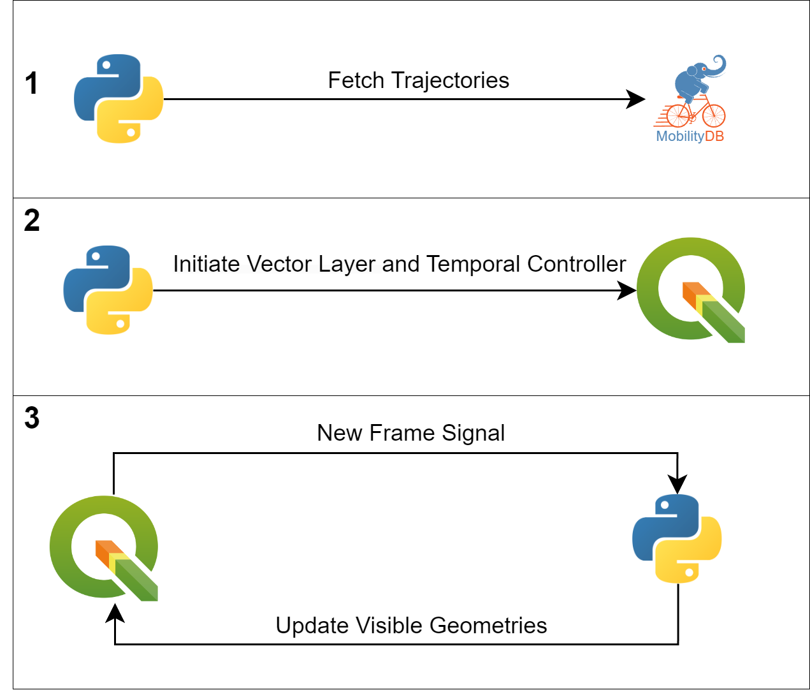

This repository contains the Proof-Of-Concept demo built to test out the Interactive Mode.

# Design Architecture

This solution works in three steps :

1. **Fetching Trajectories**: First, all the trajectories are fetched from the MobilityDB database.
2. **Initializing Vector Layer and Features**: Next, we create the Vector
Layer and initialize a unique QGIS Feature for each trajectory. The temporal
properties are activated alongside the Temporal Controller in the Animated
mode.
3. **Animation and Visualization**: Finally, during the animation and visualization phase, the on_new_frame function updates the geometries of all
QGIS Features to their new positions on each new frame signal emitted.
These positions are obtained by calling the value_at_timestamp method for the datetime associated with the new frame. When the trajectory doesn't exist for the given datetime, it's geomtry is updated to contain an Empty Point.

# Run instructions

/!\\ Check for requirements in main README file 

1. Modify the Database connection parameters in the the interactive_mode.py file
2. Open QGIS and go into the Python console(ctrl+P shortcut)
3. Paste the content of interactive_mode.py inside the scratch code file and click on run

