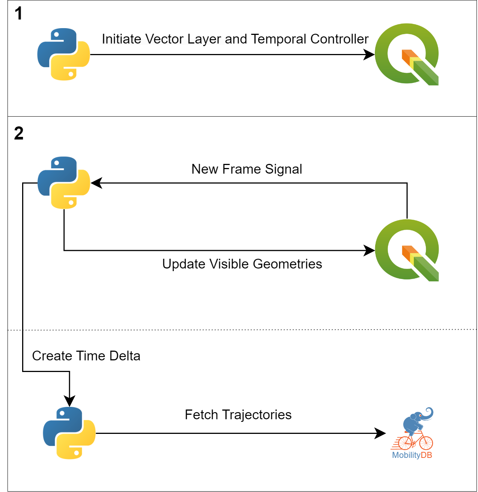

# Credits

This repository contains the Proof-Of-Concept demo built to test out the TimeDeltas Mode.


# Design Architecture


This solution works in two steps :

1. **Initializing Vector Layer, Features and temporal Controller**: We create the Vector
Layer and initialize a unique QGIS Feature for each trajectory. The temporal
properties are activated alongside the Temporal Controller in the Animated
mode.
2. **Animation and Visualization**:  The Python script will constantly update its buffer of Time Deltas. While
the animation traverses the ongoing Time Delta, a QGIS Task will create the next Time Delta in the background. When the animation reaches
the current Time Delta’s bound, the script will move on to the next Time Delta
and start a new QGIS Task to fetch the following Time Delta. This operation
repeats throughout the animation, allowing for an uninterrupted animation.

The QGIS Task stores the subsets of the trajectories appearing in the Time Delta.

# Implementation Overview

For this Proof of Concept (POC), we made some deliberate simplifications to expedite development and focus on core functionality for benchmarking:

- Backward Animation Disabled: Animation only moves forward.
- Manual Timeline Skipping Disabled: Users cannot manually skip through the timeline.
- Automatic Time Delta Reloading Disabled: users have to call reload_button() to restart the animation.
- Automatic FPS Updates: users can not pick the FPS themselves.

These restrictions are intended to streamline the initial implementation. They can be readily incorporated into a production oriented version.

# Run instructions

/!\\ Check for requirements in main README file 

To run this proof of concept, first create a new serial column in the spatiotemporal table called 'id' :
```SQL
ALTER TABLE table_name ADD COLUMN id SERIAL;
```


1. Modify the Database connection parameters in the the timedeltas_mode.py file, do not change the TPOINT_ID_COLUMN_NAME.
2. Open QGIS and go into the Python console(ctrl+P shortcut)
3. Paste the content of timedeltas_mode.py inside the scratch code file and click on run
4. Once QGIS shows the notification that the initial Time delta has been loaded, click on play


Note : If you change the temporal controller configuration(frame duration, extent) run move.reload_button() in the console and wait for the message indicating the new time delta has been loaded to start playing the animation.
